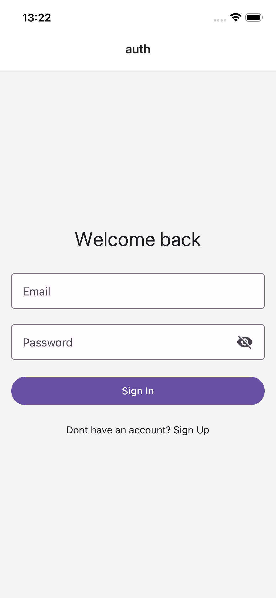
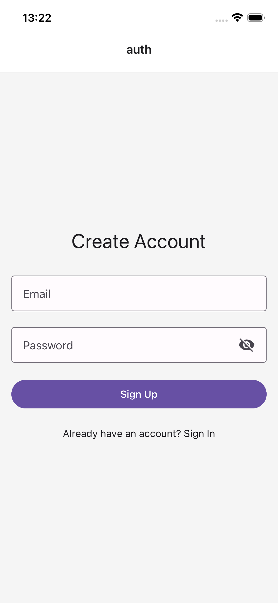
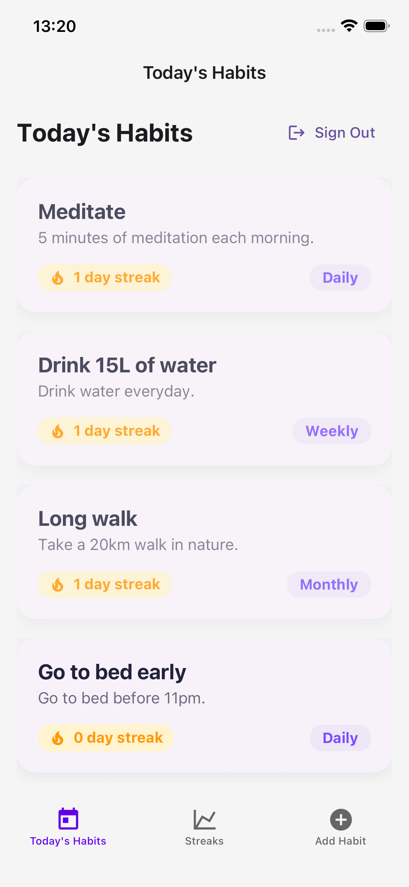
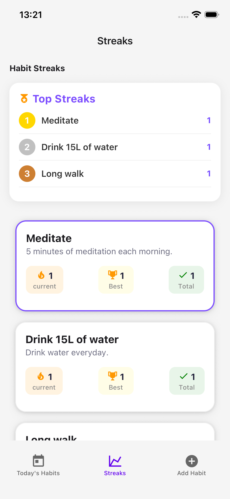
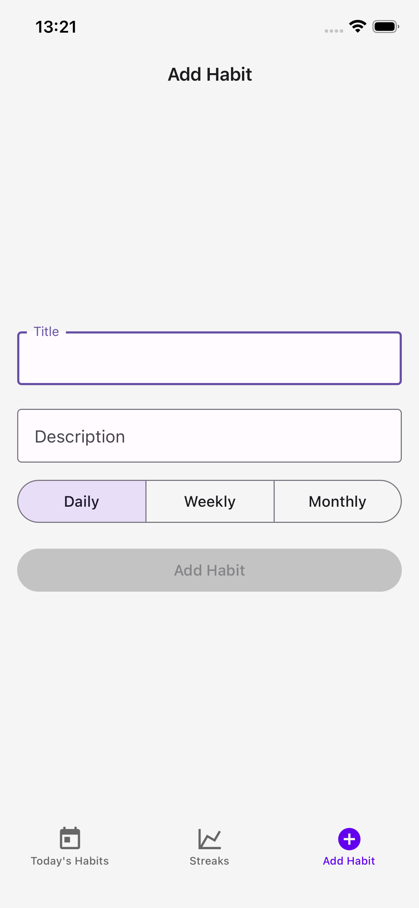

# Habit Traker App

A small React Native Project I built to explore mobile development.

This app is a habit tracker that lets users create, edit and track their habit daily / weekly / monthly habits.

It is based on a [tutorial](https://www.youtube.com/watch?v=J50gwzwLvAk) I followed but I had to adapt many parts because several librairies had changed since the video was published.

That made it a great opportunity to debug, adapt and learn React Native in depth.

## Tech Stack

- React Native (with Expo)
- Expo router
- Appwrite (for backend and database)
- React native paper
- React native gesture handler

## App features

1. **Today's Habits**

- Display all habits created by the logged-in user.
- Habits can be daily, weekly, monthly.
- Swipe right to mark habit as completed.
- Swipe left to delete a habit.

2. **Streaks**

- Displays overall progress and frequency of completed habits.
- Show off Top 3 of the habits that are most consistently followed.

3. **Add Habit**

- Lets the user create new habits.

## What I learned

During this process I had to adapt multiple parts of the code because the librairies had evolved since the tutorial's release.

- Appwrite switched from Databases to TablesDB.
- API rate limits required to locally run Appwrite.
- Protected Routes logic in Expo Router changed and I had to use Stack layouts for protected routes instead of manually setting a RouteGuard.
- React native gesture handler replaced Swipeable with ReanimatedSwipeable.

Each issus pushed me to read documentation deeply and truly understand how each library works, rather than just copying the tutorial.

## ScreenShots

<div style="display: flex; flex-wrap: wrap; gap: 10px;">
  
  
  
  
  
</div>

## What's next?

This project confirmed my interest in investigating React Native further and I'm already planning my next personal app to keep learning and experimenting.

---

## Get started

### Prerequisites

- [Node.js](https://nodejs.org/)
- [Expo CLI](https://docs.expo.dev/get-started/installation/)
- [Appwrite Account](https://appwrite.io/)

### Clone project and install dependencies

```bash
git clone https://github.com/rohmerpauline/react-native-habit-tracker.git
yarn install
```

### Configure Appwrite and create database / tables

If you want to try the app locally, you’ll need to recreate the database and tables in Appwrite. Below is the exact schema you need.

1. Install and run Appwrite locally with Docker

[Follow the instructions from the documentation](https://appwrite.io/docs/products/functions/develop-locally)

2. Create a new project in Appwrite

3. Add platforms

- In the project overview, add iOS and Android platforms.
- This will allow the React Native app to connect to Appwrite.

4. Create database (e.g. habits-db)

5. Create tables

#### Table 1: habits

| Field Name       | Type   | Required | Max Length / Constraints | Default |
| ---------------- | ------ | -------- | ------------------------ | ------- |
| `user_id`        | string | yes      | 1000                     |         |
| `title`          | string | yes      | 1000                     |         |
| `description`    | string | yes      | 1000                     |         |
| `frequency`      | string | no       | 1000                     | daily   |
| `streak_count`   | number | yes      | min: 0                   |         |
| `last_completed` | string | yes      | 1000                     |         |

- **$id field** is generated automatically when creating the table.
- **Permissions** (Settings > Permissions > All users): Create, Read, Update, Delete

#### Table 2: habit-completions

| Field Name     | Type   | Required | Max Length |
| -------------- | ------ | -------- | ---------- |
| `habit_id`     | string | yes      | 1000       |
| `user_id`      | string | yes      | 1000       |
| `completed_at` | string | yes      | 1000       |

- **$id field** is generated automatically when creating the table.
- **Permissions** (Settings > Permissions > All users): Create, Read

6. Create file .env.local

- Fill the file with keys from Appwrite by following the model from .env.example

### Run the app

```bash
npx expo start
```

## Useful Links

- [React Native Documentation](https://reactnative.dev/)
- [Appwrite Documentation](https://appwrite.io/docs)
- [Expo Documentation](https://docs.expo.dev/)

---

Based on the tutorial by [Pedro Tech](https://www.youtube.com/@PedroTechnologies).
